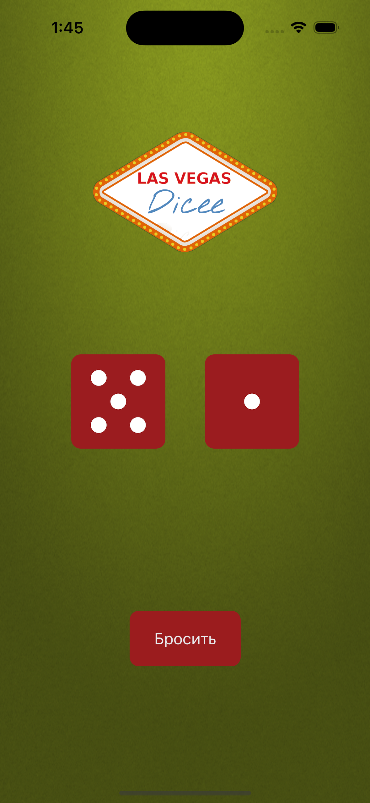

# Это учебное приложение AngelaYu_Dicee

- созданно в рамках Swift Marathon 6.0 основанном на курсе The Complete iOS App Development Bootcamp (by Dr. Angela Yu)
- на единственном экране отображает три ImageView и кнопку UIButton
- по нажатию на кнопку рандомно изменяет Image в ImageView создавая эфект брошенных костей

